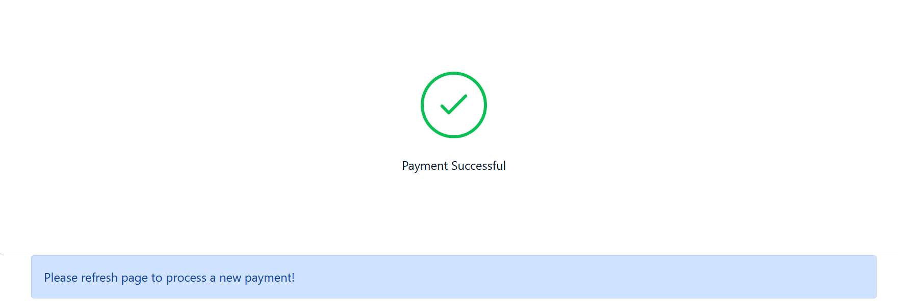

Kill Bill Adyen demo
=====================

Inspired from the [Adyen Drop-In implementation](https://docs.adyen.com/online-payments/web-drop-in).

Prerequisites
-------------

* Kill Bill is [already setup](https://docs.killbill.io/latest/getting_started.html)
* The default tenant (bob/lazar) has been created
* The [Adyen plugin](https://github.com/killbill/killbill-adyen-plugin) is installed and configured

Set up
------

1. Obtain Adyen credentials as explained [here]([https://github.com/killbill/killbill-adyen-plugin/tree/new-adyen-staging#configuration](https://github.com/killbill/killbill-adyen-plugin#configuration)) and set the corresponding values in the `application.properties` file.
2. Obtain a client key as explained [here](https://docs.adyen.com/development-resources/client-side-authentication#get-your-client-key) and set it in the `application.properties` file.
3. Add the demo URL (`http://localhost:8084/`) as an allowed origin in Adyen as explained [here](https://docs.adyen.com/development-resources/client-side-authentication#manage-allowed-origins).


Run
---

To run the app:
```
mvn spring-boot:run
```

Test 
----

1. Go to [http://localhost:8084/](http://localhost:8084/).
2. Enter amount as `20` and click **Checkout**:

3. Enter the following card details and click **Pay** (See [Adyen Test Card Numbers](https://docs.adyen.com/development-resources/testing/test-card-numbers)):
  * Card Number: 5100 0600 0000 0002
  * Expiry Date: 12/29
  * CVV: 737
  * Name on card: John Doe

4. This should display a successful payment page:


Credits
----
Code originally developed by [Wovenware](https://www.wovenware.com/).
